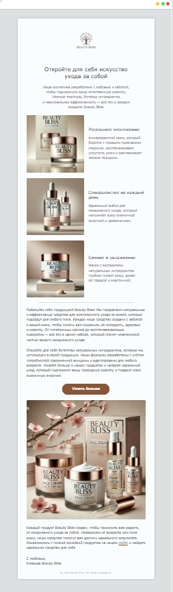

# E-mail вёрстка для рассылки магазина косметики Beauty Bliss

Этот проект представляет собой вёрстку e-mail письма для Beauty Bliss с использованием HTML и CSS. Письмо разработано с учетом кросс-клиентской совместимости и корректного отображения в разных почтовых клиентах, включая Outlook, Gmail, Yahoo и другие.

## Особенности

- **Кросс-браузерная совместимость**: Письмо отображается корректно в большинстве почтовых клиентов.
- **Адаптивная вёрстка**: Использование медиазапросов для обеспечения мобильной адаптивности.
- **Инлайн-стили**: Стили встроены непосредственно в HTML, чтобы поддерживать старые почтовые клиенты.
- **Фоновое изображение для Outlook**: Используется VML для добавления фона в Outlook, который не поддерживает стандартные CSS-свойства.

## Скриншот

  

